# Generating Handwritten Multi-Digit Writer (MDW) Number Recognition Data Sets

Author: Kiri Wagstaff, wkiri@wkiri.com 

This repository contains Python scripts to generate, and evaluate
predictions for, data sets that contain images of handwritten
multi-digit numbers.

Each multi-digit number has a single original writer.  The multi-digit
image is a concatenation of individual digits sampled from the full
NIST data set of 402,953 single-digit images, while ensuring the
digits have the same original writer.  The code uses the 28x28 version
of each digit as provided by the QMNIST data set.

Each MDW data set was inspired by a realistic use case in which
handwritten numbers occur, such as U.S. ZIP Codes, handwritten check
amounts, and appointment times.

Images generated this way show that writing style varies by writer.
For example:

| Writer | Number |
| ------ | ------ |
| 1568   | 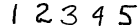 |
| 1830   | 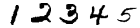 |

## Requirements

This code assumes you have Python 3.9 or higher installed.

To install requirements:

```
pip install -r requirements.txt
```

The first run of any script will download the QMNIST data files so
that the NIST images are accessible.

## Generate Multi-Digit Number Image from One Writer

To generate a multi-digit image that was created using digits from a
single writer, specify the desired number and writer id:

```
python3 create_MDW_image.py <number> <writer>
```

* Omit the writer id to get a randomly chosen writer.
* Use `-s <seed>` to specify the random number generator seed.
* By default, a random writer is chosen from
  `resources/writers-all-test.csv`.  See the `-w` option to specify a
  different source (like `resources/writers-all-train.csv`).

More examples of different writers producing the number 12345: 

| Writer | Number |
| ------ | ------ |
| 352   | 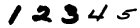 |
| 684   | 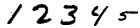 |
| 1046   | 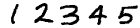 |
| 2599   | 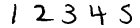 |
| 3316   |  |
| 3963   | 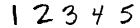 |
| 3977   | 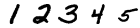 |


## Create MDW Data Sets

You can generate multi-digit writer data sets for the following
domains: U.S. ZIP Codes, handwritten check amounts, and times of day.
Results can be stored in .csv or .npz files.

Each item in a data set is represented as a list with the following
fields:

| Numeral | Writer | NIST id 0 | ... | NIST id N |
| ------- | ------ | --------- | --- | --------- |

for a number with N digits.  Each NIST id can be used to index into the
QMNIST data set to obtain the corresponding 28x28 image.

### U.S. ZIP Codes

U.S. ZIP Codes consist of five digits.  Only 37,988 of the 100,000
possible combinations are valid.  We sample from valid U.S. ZIP Codes,
then select a random writer generate a ZIP Code sample.  

```
python3 create_MDW_data.py -d zip_code -n <n_samples> -f <output_file>
```

### Handwritten Check Amounts

Handwritten checks contain two representations of the amount: a legal
amount which is written out in words, and a courtesy amount which is
written with numbers. We focus on the task of accurately recognizing
the courtesy amount. In this setting, the number of digits is
variable.  We provide 10,000 candidate amounts, with 1 to 5 digits
before the decimal and 2 digits after, in the `resources/`
directory.  This script samples from those numbers to generate
handwritten versions.

```
python3 create_MDW_data.py -d check_amount -n <n_samples> -f <output_file>
```

Punctuation is omitted from the digit sequence, but it is understood
that a decimal separates the leading digits from the final two digits.
For example, a sample created for $8367.50 would appear as:

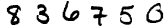

### Times of Day

Another common case in which handwritten numbers are used is to write
down the time of an appointment or important event. We focus on
24-hour clock time, which ranges from 0:00 (midnight) 210 to 23:59
(the last minute of the day). We assume that times earlier than 10:00
omit the leading digit, so the number of digits ranges from 3 to
4. 

```
python3 create_MDW_data.py -d clock_times -n <n_samples> -f <output_file>
```

Punctuation is omitted from the digit sequence, but it is understood
that a colon separates the leading digits from the final two digits.
For example, a sample created for 11:59 would appear as:

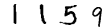

## Generate Predictions on MDW Data Sets

You can generate predictions for an MDW data set that applies, to each
digit in the multi-digit number, a single-digit classifier that was
trained on the MNIST training set.  

```
python3 predict_MDW_data.py <MDW_data_file> <preds_file>
```

* By default, this script uses a support vector machine (SVM) with RBF
kernel, but you can specify other classifiers with the `-c` option.
You can also use this script as a model to write a new prediction script
to connect to your own classifier.

* The first run will be slower since it must first train the
single-digit classifier.  Subsequent runs will re-use this classifier.

* Predictions are saved into a .csv file (preds_file) with one
recognized number (prediction) per line, in the same order as items in
the MDW data file.

## Evaluate Predictions on MDW Data Sets

To evaluate predictions against the data set labels, use the following
script and specify the domain so that task-specific metrics will be
computed:

```
python3 eval_MDW_data.py <MDW_data_file> <preds_file> -d [zip_code,check_amount,clock_time]
```

## Example Results

Here are some example results using the scikit-learn implementation of
a support vector machine (SVC) with RBF kernel and gamma set to
"scale", trained on the MNIST training set (60,000 digits) and
evaluated on 10,000 multi-digit samples generated for each domain: 

| Data set | Strict error |
| -------- | ------------ |
| U.S. ZIP Codes | 0.07 |
| Check amounts  | 0.08 |
| Clock times    | 0.05 | 

## Visualize Results

In addition to numeric results, we can use our domain knowledge to
explore errors in a task-specific way.  For example, we used the first
two digits to define a geographical region that spans many ZIP Codes,
then created a per-region test set of 100 randomly generated samples
from ZIP Codes located in that region. The following figure shows the
map of ZIP Code error rates per region for the SVM.  We find
high variability across regions, and different classifiers show
different geographical biases.

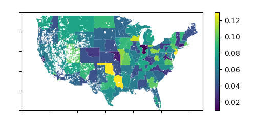

You can reproduce this result (be patient, generating 100 samples per
region takes a while) with the following command.  Please note, you
will first need to download the GeoJSON file describing ZIP Code
boundaries (thanks to John Goodall) from
[https://github.com/jgoodall/us-maps/blob/master/geojson/zcta5.geo.json](https://github.com/jgoodall/us-maps/blob/master/geojson/zcta5.geo.json)
.  Save this file in the `resources` directory.

```
python3 exp_geographical_bias.py <MDW_data_file> <preds_file>
```

## Other Experiments

You can create a learning curve that assesses strict error for ZIP
Code recognition with progressively larger amounts of MNIST training
data.  By default, this script uses an SVM, but you can change it as above. 

```
python3 exp_learning_curve.py
```

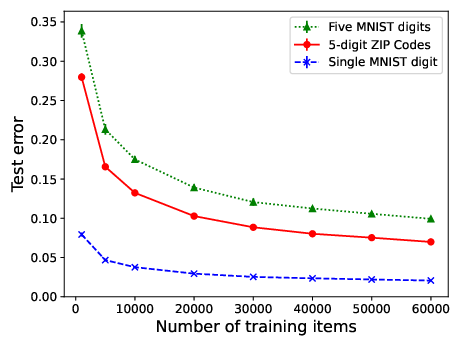

<!--
  LocalWords:  MDW NIST txt py csv npz preds RBF eval scikit SVC MNIST
  LocalWords:  SVM
  -->
